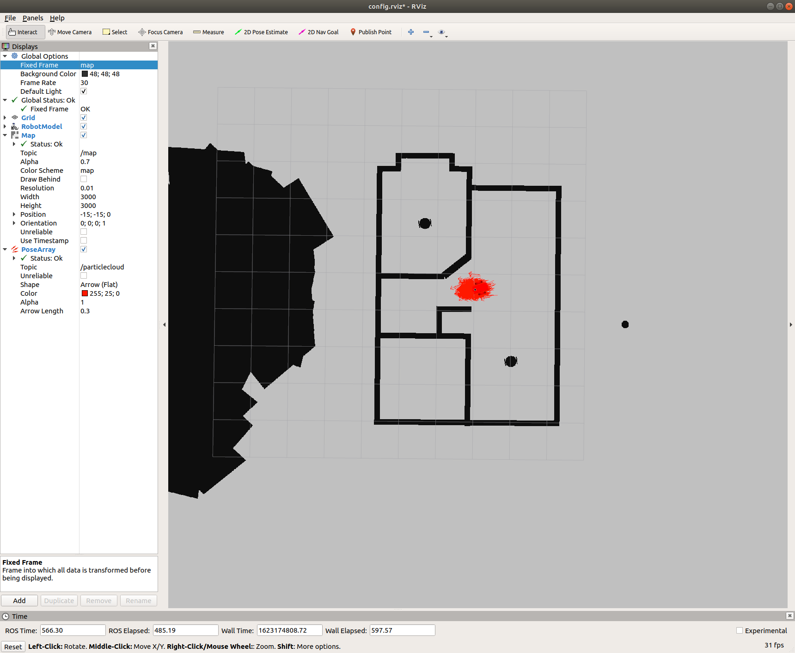

# Where-Am-I Project



### Install Requirements
This project requires `gcc>=9` due to the use of `C++17`.
```sh
$ git clone https://github.com/daniel-m-campos/where-am-i.git --recurse-submodules
$ where-am-i
$ source install-ubuntu.sh
```
#### Dependencies
* libignition-math2-dev 
* protobuf-compiler
* ros-melodic-navigation
* ros-melodic-map-server
* ros-melodic-move-base
* ros-melodic-amcl

These are installed with `source install-ubuntu.sh` for ROS `kinetic` and `melodic` only.

### Build the workspace
```sh
$ cd <path-to-repo-workspace>/where-am-i/src
$ catkin_init_workspace
$ cd ..
$ catkin_make
```

### Launching
#### Gazebo World
```sh
$ cd <path-to-repo-workspace>/where-am-i
$ source devel/setup.sh
$ roslaunch my_robot world.launch
```
#### Localization
Open a new terminal:
```sh
$ cd <path-to-repo-workspace>/where-am-i
$ source devel/setup.sh
$ roslaunch my_robot amcl.launch
```

### Workspace Structure
```sh
where-am-i/
├── config.rviz
├── img
│   ├── Gazebo1.png
│   ├── Gazebo3.png
│   ├── Gazebo4.png
│   ├── Gazebo5.png
│   ├── RViz1.png
│   ├── RViz2.png
│   ├── RViz3.png
│   ├── RViz4.png
│   └── RViz5.png
├── install-ubuntu.sh
├── README.md
└── src
    ├── CMakeLists.txt -> /opt/ros/melodic/share/catkin/cmake/toplevel.cmake
    ├── my_robot
    │   ├── CMakeLists.txt
    │   ├── config
    │   ├── launch
    │   ├── maps
    │   ├── meshes
    │   ├── package.xml
    │   ├── urdf
    │   └── worlds
    └── pgm_map_creator
        ├── cmake-build-debug
        ├── CMakeLists.txt
        ├── launch
        ├── LICENSE
        ├── maps
        ├── msgs
        ├── package.xml
        ├── README.md
        ├── src
        └── world
```